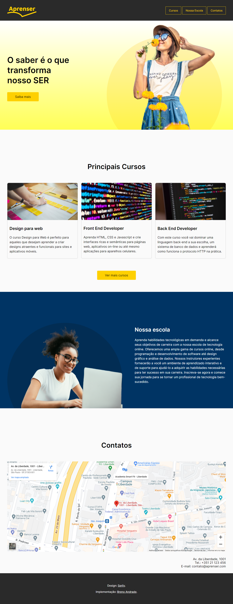

# Projeto Aprenser

Esse projeto é minha solução ao desafio apresentado na seção 9 do curso: Curso Web Frontend Fundamentos HTML5 CSS3 e JS + 10 Projetos. Esse projeto foi desenvolvido antes de assistir a solução do professor, após isso, foram aplicadas as correções necessárias informadas no curso. 

## Resultado obtido: 

### Video de apresentação:

### Imagem do site completo:

